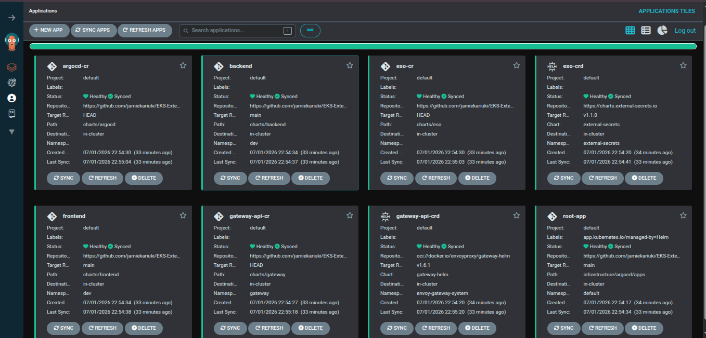
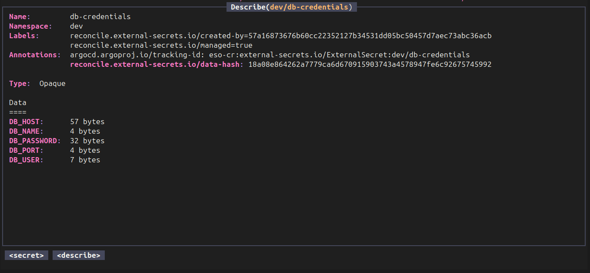
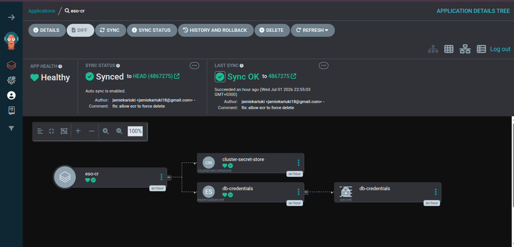

# Kubernetes External Secrets Operator -- Production Secrets Management

This project demonstrates how to manage secrets in a production Kubernetes environment using the External Secrets Operator (ESO). Rather than storing database credentials and other sensitive values as native Kubernetes `Secret` objects (which are base64-encoded at best), ESO syncs secrets from AWS Secrets Manager into the cluster on demand. The credentials never live in the repository -- not in Helm values, not in CI variables, and not in any manifest that gets committed. The only thing in version control is a reference to the secret's ARN.

The rest of the setup around this -- Terraform-managed EKS, ArgoCD app-of-apps, Envoy Gateway, GitHub Actions CI/CD -- exists to support that core idea: secrets come from a single external source, and everything in the cluster is driven by GitOps.

---

## Architecture Overview

```
AWS Secrets Manager
        |
        |  (IRSA / IAM role)
        v
External Secrets Operator
        |
        |  (creates native K8s Secret)
        v
Backend Pods  <-- envFrom: secretRef
        |
        v
Amazon RDS (PostgreSQL)
```

- **AWS Secrets Manager** holds the RDS credentials (username, password, host, port, dbname).
- **ClusterSecretStore** is configured once at the cluster level and authenticates to Secrets Manager using an IAM role bound to the ESO service account via IRSA.
- **ExternalSecret** resources in each namespace tell ESO which secret to pull and what to call the resulting K8s `Secret`. ESO syncs on a configurable interval (currently every 5 minutes) and creates the K8s `Secret` automatically.
- **Backend pods** mount that secret through `envFrom.secretRef` -- the same way they would any native secret. The application code does not know or care that the secret originated outside the cluster.

---

## Project Structure

```
.
├── charts/
│   ├── app/                  # Combined app chart (frontend + backend + eso + httproute)
│   │   ├── templates/
│   │   │   ├── app/
│   │   │   │   ├── backend/
│   │   │   │   │   ├── deployment.yaml
│   │   │   │   │   ├── service.yaml
│   │   │   │   │   └── hpa.yaml          # placeholder, not yet configured
│   │   │   │   └── frontend/
│   │   │   │       ├── deployment.yaml
│   │   │   │       ├── service.yaml
│   │   │   │       └── hpa.yaml          # placeholder, not yet configured
│   │   │   ├── external-secret.yaml      # ExternalSecret CRD for ESO
│   │   │   ├── config-map.yaml           # non-sensitive DB config (host, port, db name)
│   │   │   └── httproute.yaml            # Gateway API HTTPRoute
│   │   ├── values.yaml                   # base values
│   │   ├── values-dev.yaml               # dev overrides (image tags, DB host, secret ARN)
│   │   ├── values-stage.yaml             # stage overrides
│   │   └── values-prod.yaml              # prod overrides
│   ├── eso/                  # Standalone ESO chart (ClusterSecretStore + ExternalSecret)
│   │   ├── templates/
│   │   │   ├── secret-store.yaml         # ClusterSecretStore pointing to AWS Secrets Manager
│   │   │   └── external-secret.yaml      # ExternalSecret with per-property mapping
│   │   └── values.yaml
│   ├── gateway/              # Envoy Gateway (GatewayClass + Gateway + HTTPRoute)
│   │   ├── templates/
│   │   │   ├── gateway-class.yaml
│   │   │   ├── gateway.yaml
│   │   │   └── httproute.yaml
│   │   └── values.yaml
│   ├── argocd/               # ArgoCD HTTPRoute for external access
│   ├── frontend/             # Standalone frontend chart
│   └── backend/              # Standalone backend chart
├── .github/
│   ├── workflows/
│   │   ├── ci.yaml           # Build & push images to ECR (manual trigger)
│   │   └── infrastructure.yaml  # Full infra lifecycle (Terraform + Helm + ArgoCD)
│   └── scripts/
│       ├── extract-tf-outputs.sh   # Pulls Terraform outputs from S3 state
│       └── update-helm.sh          # Patches Helm values with TF outputs, commits back
└── infrastructure/
    ├── infra/               # Terraform for EKS, VPC, RDS, ECR, IAM
    └── argocd/              # Terraform for ArgoCD app-of-apps deployment
```

---

## How Secrets Flow Through the System

1. **RDS credentials are stored in AWS Secrets Manager.** The secret contains keys for `username`, `password`, `host`, `port`, and `dbname`. Each environment (dev, stage, prod) has its own secret, identified by a unique ARN.

2. **Terraform creates an IAM role for ESO.** This role is attached to the `external-secrets-sa` service account in the `external-secrets` namespace using IRSA. The role has a trust policy scoped to the EKS cluster's OIDC provider and a permissions policy that grants `secretsmanager:GetSecretValue` on the specific secret ARN.

3. **The `ClusterSecretStore` tells ESO how to reach Secrets Manager.** It references the service account that carries the IRSA role, so every ExternalSecret in any namespace can authenticate without per-namespace credentials.

4. **Each `ExternalSecret` resource maps remote properties to local keys.** For example, the `eso` chart maps `property: username` from the Secrets Manager secret to `secretKey: DB_USER` in the resulting K8s `Secret`. The backend deployment then reads `DB_USER` and `DB_PASSWORD` as environment variables via `envFrom`.

5. **ESO syncs on a schedule.** The `refreshInterval` is set to `5m0s`, meaning ESO checks Secrets Manager every 5 minutes. If the secret has been rotated in AWS, the K8s `Secret` is updated automatically. No pod restart is needed for most use cases, but if the application requires it, a rolling restart can be triggered through ESO's `rewrite` or a controller that watches for secret changes.

---

## Environment-Specific Configuration

Each environment has its own values overlay:

| File                | Namespace | Secret ARN Source                                |
| ------------------- | --------- | ------------------------------------------------ |
| `values-dev.yaml`   | `dev`     | `arn:aws:secretsmanager:...:rds!db-af91fbb1-...` |
| `values-stage.yaml` | `stage`   | `arn:aws:secretsmanager:...:rds!db-01cbfbc8-...` |
| `values-prod.yaml`  | `prod`    | `arn:aws:secretsmanager:...:rds!db-01cbfbc8-...` |

The only thing that changes between environments in the secret configuration is the ARN pointing to the correct Secrets Manager entry. The ExternalSecret template, the key mappings, and the refresh interval stay the same. ArgoCD selects the right values file per environment when deploying.

---

## CI/CD Pipeline

### Image Build (`ci.yaml`)

Manually triggered. Select `frontend` or `backend` from the dropdown, and the workflow:

1. Authenticates to AWS via GitHub OIDC (no long-lived keys).
2. Builds the Docker image using Buildx with layer caching (GHA cache backend).
3. Pushes to Amazon ECR tagged with the short git SHA (or a custom tag if provided).
4. Optionally tags and pushes `:latest`.

Concurrency is scoped per service, so a frontend and backend build can run in parallel but two frontend builds cannot.

### Infrastructure (`infrastructure.yaml`)

Manually triggered with environment (dev/stage/prod) and action (plan/apply/destroy). The job flow:

```
guard --> infra-plan --> infra-apply --> update-helm --> argocd-plan --> argocd-apply
              |
              +--> destroy (tears down ArgoCD first, then infra)
```

- **Terraform state** is stored in S3 with DynamoDB locking.
- **Workspaces** separate environments within the same state file.
- **ci-secrets.tfvars** is generated at runtime from GitHub Secrets and never committed.
- After `infra-apply`, the `update-helm` job pulls Terraform outputs (ECR repo URLs, IRSA ARN) from S3 state, patches the Helm chart values using `yq`, and commits the changes back to the repo.
- ArgoCD then picks up the updated values on its next sync.
- Destroy is ordered: ArgoCD first (so it stops reconciling child apps), then infrastructure.

---

## Screenshots

### ArgoCD -- All Apps Deployed



### kubectl -- Secrets Synced by ESO



### ESO Configuration



---

## What This Project Does Not Cover

These are things that matter in a real production environment but are not implemented here. If you are using this as a reference or taking it further, these are the gaps to address.

### Secret Rotation

ESO supports automatic secret rotation, but this project relies on polling every 5 minutes. In production you should consider:

- Setting up AWS Secrets Manager rotation (using a Lambda function) so that the password in Secrets Manager is rotated on a schedule. ESO will pick up the new value on its next sync.
- Using ESO's `secretStoreRef` with a `SecretStore` (namespace-scoped) instead of `ClusterSecretStore` if you need to restrict which namespaces can access which secrets. Right now any namespace can reference the cluster-level store.
- Adding a controller or webhook that triggers a rolling restart of pods when a secret changes, since most applications load environment variables at startup and will not pick up changes to the underlying `Secret` object mid-flight.

### RBAC and Least Privilege

The IRSA role for ESO should be scoped to the minimum set of secrets it needs to read. If you add more secrets over time, audit the IAM policy to make sure you are not granting broad `secretsmanager:GetSecretValue` on `*`.

Similarly, ArgoCD's service account within the cluster should have RBAC that limits it to the namespaces and resources it actually manages. The app-of-apps pattern is powerful but it also means a single compromised Application CRD can deploy into any namespace ArgoCD has access to.

### Network Policies

There are no Kubernetes `NetworkPolicy` resources in these charts. In production, the ESO controller pods should only be allowed to make outbound HTTPS calls to the AWS Secrets Manager endpoint. The backend pods should only be allowed to talk to the RDS instance and nothing else. Without network policies, any pod in the cluster can reach any other pod on any port.

### Pod Security

No `PodSecurity Standards` are enforced at the namespace level. For production, you should label namespaces with:

```yaml
pod-security.kubernetes.io/enforce: restricted
```

And ensure containers run as non-root, drop all capabilities, and use read-only root filesystems where possible.

### Monitoring and Alerting

There is no observability stack in this project. For production:

- Monitor ESO sync failures. ESO exposes Prometheus metrics (`externalsecret_sync_total`, `externalsecret_sync_error_total`). Set up alerts for sync errors.
- Monitor the age of synced secrets. If a secret has not been refreshed in longer than the `refreshInterval`, something is wrong.
- Log the ESO controller logs and send them to a centralized log aggregator (CloudWatch, Datadog, or whatever you use).
- Set up alerting on the backend pod health, RDS connection metrics, and Envoy Gateway access logs.

### TLS Termination

The Gateway and HTTPRoute resources in this project only listen on port 80 (HTTP). In production, all traffic should be terminated over TLS. For Envoy Gateway, this means either:

- Adding a TLS listener on the Gateway with a certificate from ACM or a cert-manager `Certificate` resource.
- Putting a TLS-terminating load balancer (like AWS ALB) in front of the Gateway.

### Database Connection Security

The backend connects to RDS over the default port. In production, the RDS instance should be in a private subnet with no public access. The connection between the pods and RDS should use TLS (the `PGSSLMODE=require` environment variable for PostgreSQL). The current setup has the DB host in a ConfigMap and the credentials in an ESO-managed Secret, which is the right split, but the TLS enforcement is missing.

### HPA Configuration

Both the frontend and backend charts have placeholder `hpa.yaml` files that are empty. In production, these should be configured with appropriate CPU/memory thresholds and min/max replica counts so the workloads can scale under load.

### CI/CD Gaps

- The `ci.yaml` workflow does not run tests or linting before building. Add unit tests, integration tests, or at least a `helm lint` / `helm template` step.
- There is no automated rollback. If ArgoCD syncs a bad change, you need to manually roll back in the ArgoCD UI or revert the Git commit. Consider adding ArgoCD rollback automation or pre-sync hooks that validate the Helm release.
- The infrastructure workflow uses a single OIDC role for all environments. In a real multi-account or multi-team setup, each environment should have its own OIDC role with its own permission boundary.
- No cost controls or budget alerts are wired into the infrastructure pipeline. AWS Budgets integration would catch runaway costs from accidentally leaving resources running.

---

## Prerequisites

- Kubernetes 1.28+ (Gateway API v1 GA)
- External Secrets Operator installed in the cluster
- AWS account with Secrets Manager, ECR, EKS, RDS access
- IAM role for ESO service account (IRSA)
- ArgoCD installed and configured with the repository as a source
- Envoy Gateway controller running in the cluster
- `kubectl`, `helm`, `terraform` CLI tools

---

## Quick Reference

### Deploy ESO resources

```bash
helm upgrade --install eso ./charts/eso -n dev -f ./charts/eso/values.yaml
```

### Verify secret sync

```bash
kubectl get externalsecret -n dev
kubectl get secret db-credentials -n dev -o jsonpath='{.data}' | jq 'keys'
```

### Check ESO controller logs

```bash
kubectl logs -n external-secrets -l app.kubernetes.io/name=external-secrets --tail=50
```

### Describe an ExternalSecret for sync status

```bash
kubectl describe externalsecret db-credentials -n dev
```

### Force an immediate sync

```bash
kubectl annotate externalsecret db-credentials -n dev \
  force-sync=$(date +%s) --overwrite
```
